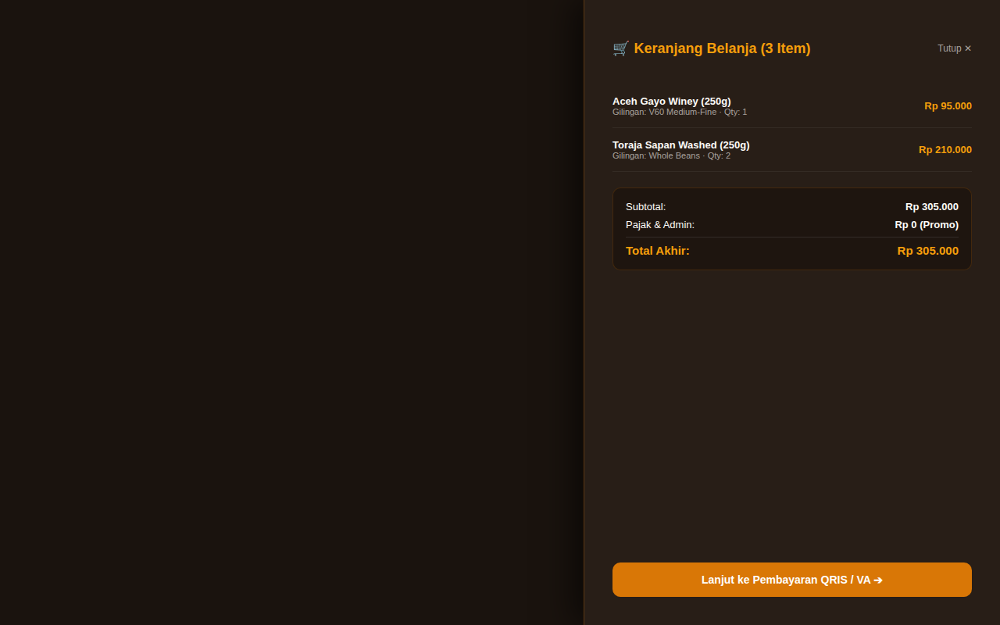

# ☕ KopiKita — Specialty Single Origin Beans E-Commerce

> **Full-stack specialty coffee bean store built with NestJS, Prisma, and PostgreSQL. Features flavor profile radars, grind selection, and slide-over cart drawer.**

---

## 📸 Visual Showcase & Cart Operations

  

<em>Figure 1: Specialty Single-Origin Bean Catalog with tasting notes, harvest elevations, and roast profiles.</em>

 

  <table width="100%">
    <tr>
      <td width="100%" align="center">
        
         <strong>Figure 2: Slide-Over Shopping Cart Drawer</strong> 
        <em>Real-time cart state management with instant quantity adjustment and QRIS/VA checkout trigger.</em>
      </td>
    </tr>
  </table>

